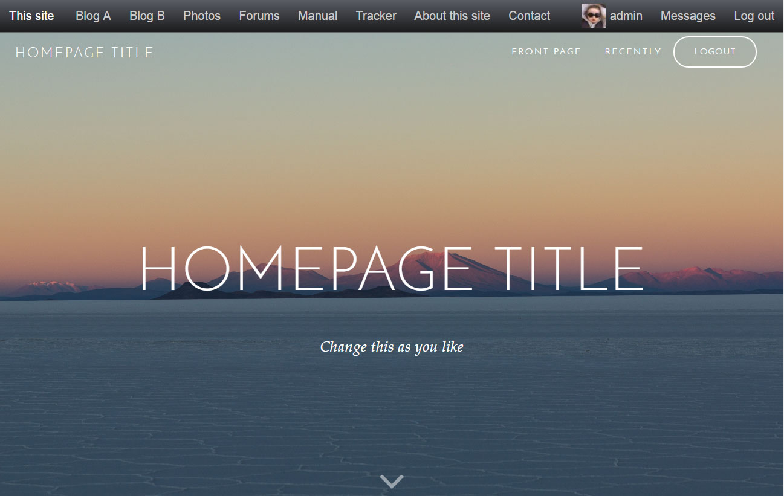

# jared_skin
"Jared" skin for b2evolution CMS.

"Jared" is equipped with a set of predefined <a href="https://www.w3schools.com/css/css_syntax.asp" target="blank_">CSS classes</a>, that can be used to change content layout througout the skin.

#### Menu links class

<code>.menu-button</code> - creates special menu link layout

#### Font size classes

<code>.text-xl</code> - increases font size by 60%
<code>.text-lg</code> - increases font size by 30%
<code>.text-sm</code> - decreases font size by 20%
<code>.text-xs</code> - decreases font size by 40%

#### Special classes implementation

These classes can be simply insert:
1) in widgets - in CSS Class field, for example here: http://b2evolution.net/media/blogs/man/skin-guide/widget_edit_screen.png?mtime=1428614162 or through HTML Widget;
2) in posts, through Markup post view.